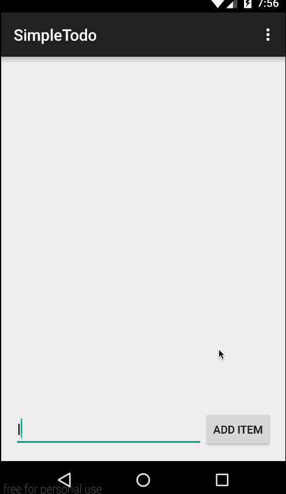

# SimpleTodo Demo

Building a Todo Application.

Time spent: 5 hours spent in total

Completed user stories:

 * [x] Required: View a list of existing items.
 * [x] Required: Click Button to Add a new item.
 * [x] Required: Touch ListItem to Remove an item.
 * [x] Optional: Press ENTER on EditText to add a new item.
 
Notes:

Spent some time making the UI work across multiple phone resolutions by playing around with the RelativeLayout.

Walkthrough of all user stories:

GIF created with [LiceCap](http://www.cockos.com/licecap/).
